# spring-boot-microservices

This project is a guide to learning Microservices, specifically, using Spring Boot, Docker and Kubernetes.
It is split into 2 sections, Part A consists of content pertaining to Building Microservices,
while Part B contains material associated with Deploying Microservices.

## Table of Contents

[A. Building Microservices](#a-building-microservices)
<br>
[1. Building REST Services](#1-building-the-services)
<br>
[2. Communication between Microservices](#2-communication-between-microservices)
<br>
&nbsp;&nbsp;&nbsp;&nbsp;&nbsp;[2.1 Synchronous Communication](#21-synchronous-communication)
<br>
&nbsp;&nbsp;&nbsp;&nbsp;&nbsp;[2.2 Asynchronous Communication](#22-asynchronous-communication)
<br>
&nbsp;&nbsp;&nbsp;&nbsp;&nbsp;[2.3 Implementation (WebClient, OpenFeign)](#23-implementation-webclient-openfeign)
<br>
[3. Service Discovery](#3-service-discovery)
<br>
&nbsp;&nbsp;&nbsp;&nbsp;&nbsp;[3.1 Implementation (Eureka)](#31-implementation-eureka)
<br>
[4. API Gateway](#4-api-gateway)
<br>
&nbsp;&nbsp;&nbsp;&nbsp;&nbsp;[4.1 Implementation (Spring Cloud Gateway)](#41-implementation-spring-cloud-gateway)
<br>
[5. Security](#5-security)
<br>
&nbsp;&nbsp;&nbsp;&nbsp;&nbsp;[5.1 Implementation (Keycloak)](#51-implementation-keycloak)
<br>
[6. Circuit Breaker](#6-circuit-breakers)
<br>
&nbsp;&nbsp;&nbsp;&nbsp;&nbsp;[6.1 Implementation (Resilience4J, Hystrix)](#61-implementation-resilience4j-hystrix)
<br>
[7. Centralize Configuration](#7-centralize-configuration)
<br>
&nbsp;&nbsp;&nbsp;&nbsp;&nbsp;[7.1 Implementation (Cloud Config)](#71-implementation-spring-cloud-config)
<br>
[8. Distributed Tracing](#8-distributed-tracing)
<br>
&nbsp;&nbsp;&nbsp;&nbsp;&nbsp;[8.1 Implementation (Spring Cloud Sleuth & Zipkin)](#81-implementation-spring-cloud-sleuth--zipkin)
<br>
[9. Message Brokers/Queues](#9-message-brokers--queues)
<br>
&nbsp;&nbsp;&nbsp;&nbsp;&nbsp;[9.1 Implementation (Kafka, RabbitMQ)](#91-implementation-kafka-rabbitmq)
<br>
[B. Deploying Microservices](#b-deploying-microservices)
<br>
[1. Packaging / Containerizing the Application](#1-packaging--containerizing-the-application)
<br>
&nbsp;&nbsp;&nbsp;&nbsp;&nbsp;[1.1 Docker](#11-docker)
<br>
&nbsp;&nbsp;&nbsp;&nbsp;&nbsp;&nbsp;&nbsp;&nbsp;&nbsp;&nbsp;[1.1.1 Dockerfile](#111-dockerfile)
<br>
&nbsp;&nbsp;&nbsp;&nbsp;&nbsp;&nbsp;&nbsp;&nbsp;&nbsp;&nbsp;[1.1.2 Docker Compose](#112-docker-compose)
<br>
&nbsp;&nbsp;&nbsp;&nbsp;&nbsp;&nbsp;&nbsp;&nbsp;&nbsp;&nbsp;[1.1.3 Docker Hub](#113-docker-hub)
<br>
&nbsp;&nbsp;&nbsp;&nbsp;&nbsp;[1.2 Jib](#12-jib)
<br>
[2. Managing the Application](#2-managing-the-application)
<br>
&nbsp;&nbsp;&nbsp;&nbsp;&nbsp;[2.1 Kubernetes](#21-kubernetes)
<br>

## A. Building Microservices

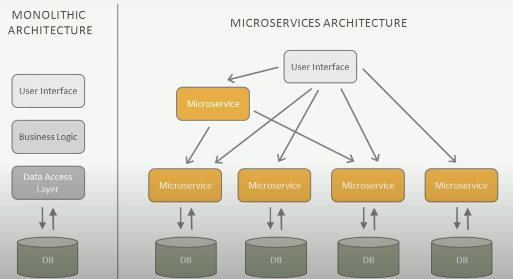

In simple terms, a monolithic application is built as a single unified unit while a microservices architecture is a collection of smaller, independently deployable services.

The monolithic architecture is considered to be a traditional way of building applications. 
A monolithic application is built as a single and indivisible unit. Usually, such a solution comprises a 
client-side user interface, a server side-application, and a database. 
It is unified and all the functions are managed and served in one place.

Normally, monolithic applications have one large code base and lack modularity. 
If developers want to update or change something, they access the same code base. 
So, they make changes in the whole stack at once.

| Strengths | Weaknesses |
|---|---|
| Easy to develop | Less scalability |
| Simple deployment | Inability to adapt to new technologies |
| Uncomplicated testing and debugging | High dependence between functionalities |

While a monolithic application is a single unified unit, a microservices architecture breaks it down 
into a collection of smaller independent units. 
These units carry out every application process as a separate service. 
So all the services have their own log ic and the database as well as perform the specific functions.

Within a microservices architecture, the entire functionality is split up into independently deployable 
modules which communicate with each other through defined methods called APIs.
Each service covers its own scope and can be updated, deployed, and scaled independently.


| Strengths | Weaknesses |
|---|---|
| Independent services | Time and resource-consuming |
| Enables agile development | Complicated deployment |
| Scalable & reliable | Complex testing |


SO WHICH SOFTWARE ARCHITECTURE SUITS YOUR SOLUTION AND YOUR BUSINESS BEST?

Choosing a monolithic architecture:

- Small team.
- A simple application.
- No microservices expertise.
- Quick launch.

Choosing a microservices architecture:

- Microservices expertise.
- A complex and scalable application. 
- Enough engineering skills.


Spring Cloud provides many design patterns to help build Microservice applications. 
Here is a typical Microservice application developed using Spring based modules:

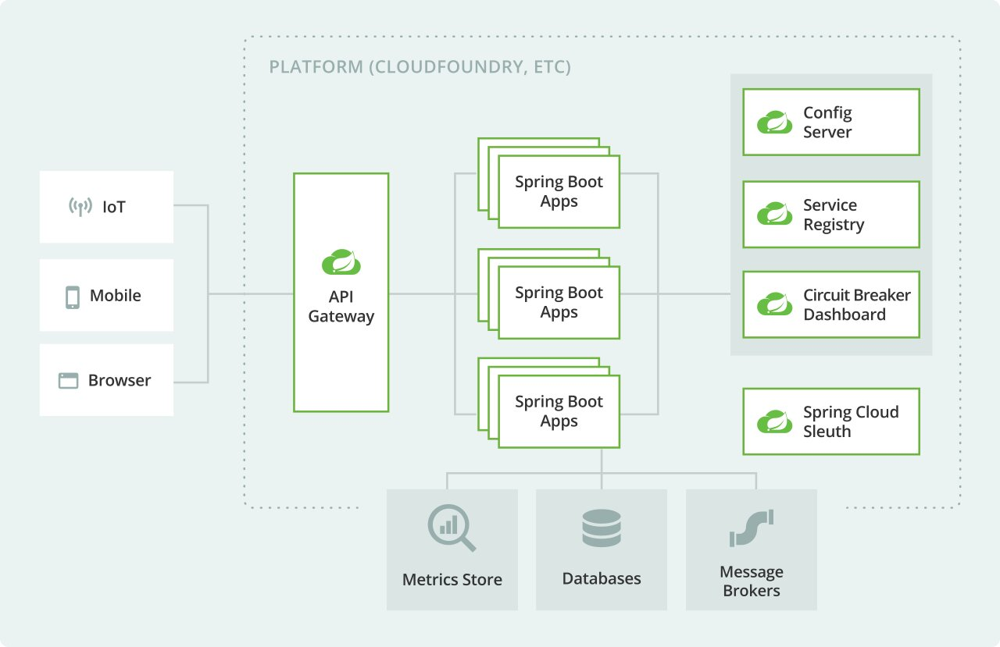

Introduction to this topic: [Introduction to Microservices, Docker, and Kubernetes (YouTube/JamesQuigley)](https://www.youtube.com/watch?v=1xo-0gCVhTU)
<br>
Link to: [Microservices vs Monolith: which architecture is the best choice for your business? (n-ix.com/RomanaGnatyk)](https://www.n-ix.com/microservices-vs-monolith-which-architecture-best-choice-your-business/)
<br>
Link to: [the Basic Microservices Architecture with Spring Cloud (devo.to/BrunoDrugowick)](https://dev.to/brunodrugowick/project-overview-the-basic-microservices-architecture-with-spring-cloud-2e8e)
<br>

## 1. Building the Services

The Microservices Example developed in this project comes from: [Spring Boot Microservices Project Example - Part 1 | Building Services (YouTube/ProgrammingTechie)](https://www.youtube.com/watch?v=lh1oQHXVSc0&list=PLSVW22jAG8pBnhAdq9S8BpLnZ0_jVBj0c)
<br>

Spring Boot Microservices Project Example Architecture:
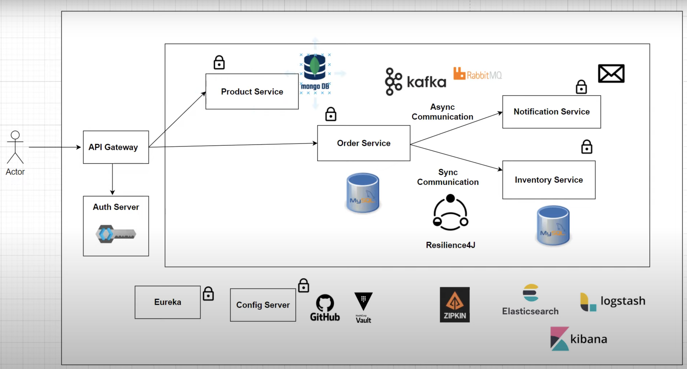

To build the microservices, we must first separate the components that would be present in a Monolithic application
into smaller, independent applications. 

For example, instead of building a "Store App" with Model, Repository, Service and Controller layers for Product, Order and Inventory, we extract these into their own individual applications.
Here, we will end up with product-service, order-service and inventory-service applications.

We must not forget to carry out appropriate tests for each microservice, this is typically carried out in the form of integration tests.
For testing, we can make use of Testcontainers which allows us to run JUnit tests in lightweight throwaway instances of databases that can be run in Docker containers!

Furthermore, it will be more functional to adopt a Maven multi-module project to manage the microservices/applications easier.

## 2. Communication between Microservices

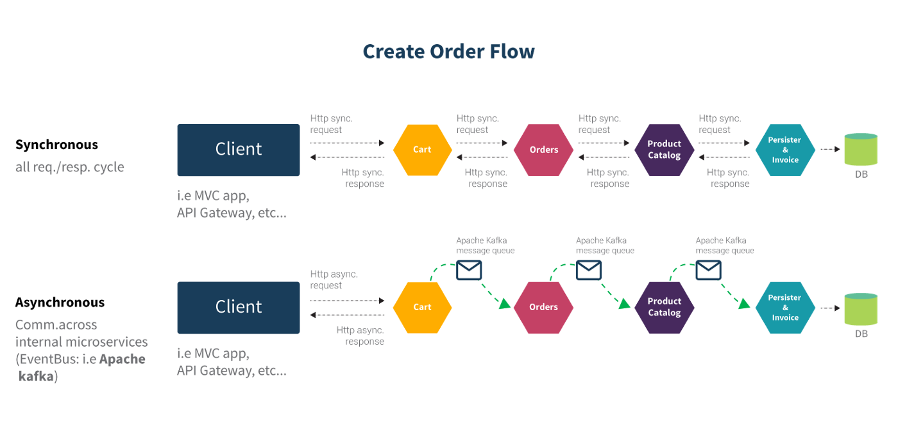

If you are working with a Spring Boot project which involves multiple microservices, 
You might have felt the need to communicate from one microservice to another. 
Depending upon business use-cases, this communication can be of synchronous or asynchronous type.

## 2.1 Synchronous Communication

In the case of Synchronous Communication, the client sends a request and waits for a response from the service. 
The important point here is that the protocol (HTTP/HTTPS) is synchronous and the client code can only continue 
its task when it receives the HTTP server response.

An example of where this might be used is in an e-commerce application, if a customer searches for a particular 
product to purchase then that product’s availability needs to be validated in the inventory by making a request 
to product availability service. 
Because customer should know about the current availability of the product to place the order.
In this case, you can use synchronous communication to get the product’s real-time availability 
in inventory and price information.

For Synchronous Communication: Can make use of REST Template, OpenFeign or WebClient.

## 2.2 Asynchronous Communication

In the case of Asynchronous Communication, The client sends a request and does not wait for a response from the service. 
The client will continue executing its task - It does not wait for the response from the service.

An example of where this might be used is in the banking domain, loan request should be processed and needs approval at multiple levels. 
So in this case, when a user raises a request for the loan then the loan request service will provide some reference number immediately. 
Once all the approvals are done, will persist the loan request details in the database. 
So in this scenario, we can use asynchronous communication.

For Asynchronous Communication: Can make use of Message Brokers / Message Queues such as RabbitMQ and Apache Kafka.

## 2.3 Implementation (WebClient, OpenFeign)

WebClient is an interface representing the main entry point for performing web requests.
It was created as part of the Spring Web Reactive module and will be replacing the classic RestTemplate in these scenarios.

Link to WebClient examples: 
<br>
[Calling REST from Java with Spring WebClient (YouTube/vaadinofficial)](https://www.youtube.com/watch?v=-U_dDUAw_OM)
<br>
[Using WebClient to make API calls (YouTube/JavaBrains)](https://www.youtube.com/watch?v=F3uJyeAyv5g)

OpenFeign, originally known as Feign and sponsored by Netflix, is designed to allow developers to use a declarative 
way to build HTTP clients by means of creating annotated interfaces without writing any boilerplate code.

Link to OpenFeign examples:
<br>
[Feign Client Using Spring Boot (YouTube/PlayJava)](https://www.youtube.com/watch?v=tlshVRtbS_c)

Implementation of Asynchronous Communication is covered in Section X. Message Brokers/Queues.

## 3. Service Discovery

Microservices are dynamic in nature. This means multiple instances of a single Microservice 
will be co-existing. 
Most probably your instances will either have a different IP address or a different port or both. 
And the number of instances will be dynamic too. This brings up loads of questions —
- How do I know the location of any Microservice instance?
- How can I keep a track of all the instances?
- How do I select a Microservice instance?
- What happens if the Microservice instance goes down?

When building REST APIs, We are assuming the URL (e.g. http://localhost:8080/product/**) to be constant 
but in reality, it is dynamic. All parts of it — be it hostname or the port .

Service Discovery comes to the rescue. This provides a mechanism that keeps track of all the services and their instances. 
All the Microservices register to it and keep updating their network information regularly.

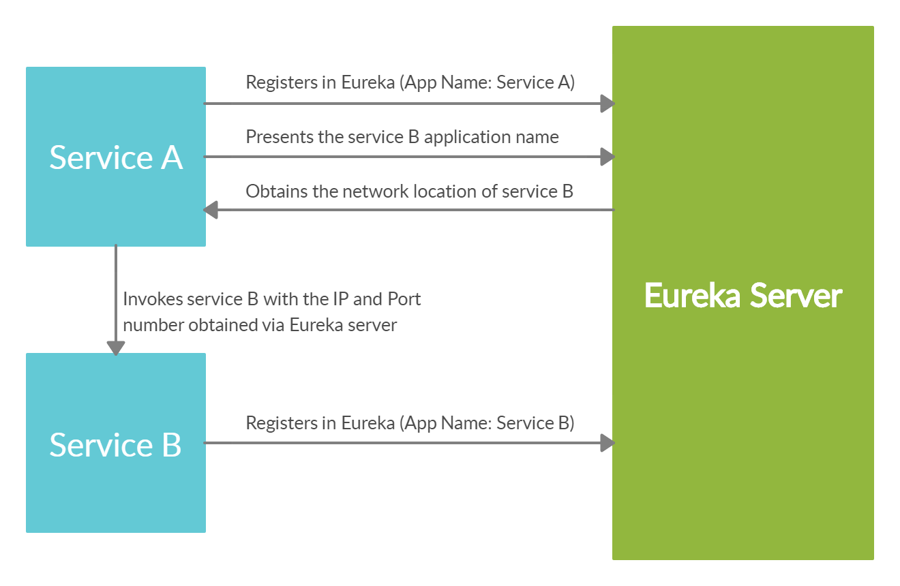

The problem can be resolved by creating a Discovery Server where our microservices can register themselves. 
The discovery server will keep a track of all the instances, their hosts, ports, and health status. 
If a service needs to communicate with another service, it needs to get the instance info from this 
discovery server. However, Load balancing is a must as the discovery server does not handle it automatically.

Above describes Client-side Service Discovery but, you can also have Server-side Service Discovery.
Server-side is similar to the option above but the load balancing is not happening at the client side. 
We have a dedicated proxy server that takes care of this.

Link to more info:
<br>
[Spring Boot Microservices — Developing Service Discovery (Medium/LalVerma)](https://lalverma.medium.com/spring-boot-microservices-implementing-service-discovery-cfc98e49b74f)

## 3.1 Implementation (Eureka)

Can make use of client-side service discovery via “Spring Cloud Netflix Eureka”. We need to ensure the correct dependencies and configurations
are entered on both the Server and Client(s). Load balancing is a must as the discovery server does not handle it automatically.

Client-side service discovery allows services to find and communicate with each other without hard-coding 
the hostname and port. The only ‘fixed point' in such an architecture is the service registry, with 
which each service has to register.

Link to Eureka examples:
<br>
[Spring Boot Microservices Project Example - Part 3 | Service Discovery (YouTube/ProgrammingTechie)](https://www.youtube.com/watch?v=0TQliqoX6Kc&list=PLSVW22jAG8pBnhAdq9S8BpLnZ0_jVBj0c&index=3)

## 4. API Gateway

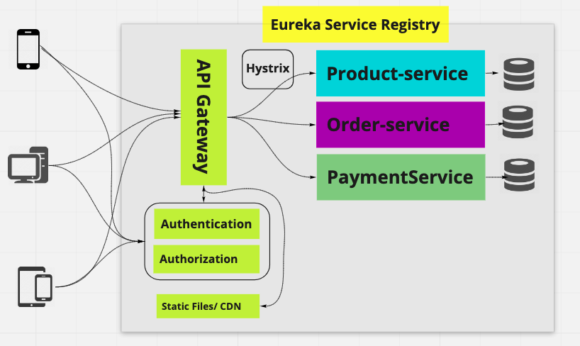
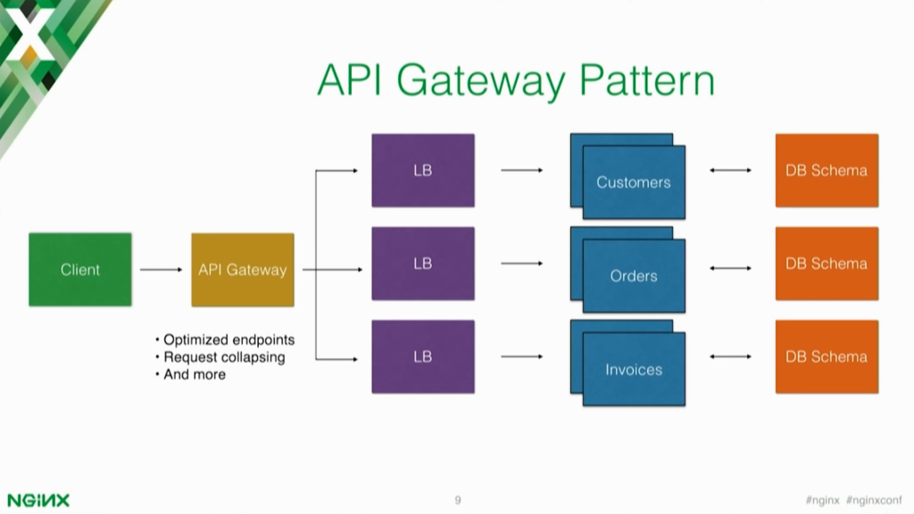

An API gateway is the single entry point for all clients. The API gateway handles requests in one of two ways.
Some requests are simply proxied/routed to the appropriate service.
It handles other requests by fanning out to multiple services.

Rather than provide a one-size-fits-all style API, the API gateway can expose a different API for each client.
For example, the Netflix API gateway runs client-specific adapter code that provides each client with an API
that’s best suited to its requirements.

The API gateway might also implement security, e.g. verify that the client is authorized to perform the request

## 4.1 Implementation (Spring Cloud Gateway)

Spring Cloud Gateway provides a library for building API gateways on top of Spring and Java. 
It provides a flexible way of routing requests based on a number of criteria, as well as focuses on 
cross-cutting concerns such as security (authentication), resiliency (load balancing), and monitoring.

Link to Spring Cloud Gateway examples:
<br>
[Spring Boot Microservices Project Example - Part 4 | API Gateway (YouTube/ProgrammingTechie)](https://www.youtube.com/watch?v=0TQliqoX6Kc&list=PLSVW22jAG8pBnhAdq9S8BpLnZ0_jVBj0c&index=4)

## 5. Security

An important aspect of securing your applications is authorization and access to the API resources. 
If you think about web app authorization, the first approach that probably comes to your mind is OAuth 2.0 
or OpenID Connect. OAuth 2.0 is the industry-standard protocol for authorization. 
Of course, it is supported by Spring Security. 
There are also multiple OAuth2 providers (Google, Github, etc.) you can integrate your application with. One of them is Keycloak.

## 5.1 Implementation (Keycloak)

Keycloak is an open-source identity and access management solution which makes it easy to secure modern applications  with less code.
Keycloak provides both SAML and OpenID protocol solutions which are industry standard so definitely
Building an application that is integrated with Keycloak will provide you a more secure and stable solution.

We are going to enable and configure OAuth 2.0 support on the API gateway via Keycloak on a Docker container. 
Must ensure configurations such as Issuer URI and SecurityConfig.class is added.
When using POSTMAN for communicating with the REST API's, we must select OAuth2.0
in Authorization Type and complete the configuration options as per our KeyCloak settings.
This will allow us to use JWT's issued by KeyCloak.

Link to Keycloak examples:
<br>
[Spring Boot Microservices Project Example - Part 5 | Security (YouTube/ProgrammingTechie)](https://www.youtube.com/watch?v=0TQliqoX6Kc&list=PLSVW22jAG8pBnhAdq9S8BpLnZ0_jVBj0c&index=5)
<br>
[Securing Spring Boot Microservices with Keycloak using OpenID | OAuth2.0 (YouTube/JavaTechie)](https://www.youtube.com/watch?v=La082JsJoH4)
<br>

## 6. Circuit Breakers

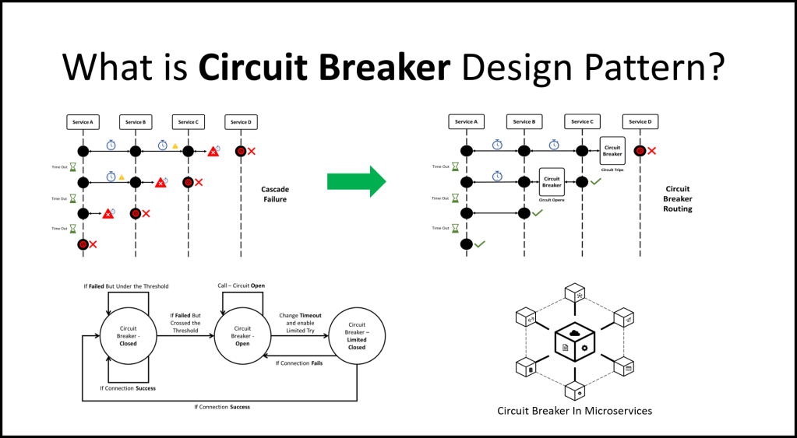

In microservices, an application or service makes a lot of remote calls to applications running in different services, 
usually on different machines across a network. If there are many callers to an unresponsive service, you 
can run out of critical resources leading to cascading failures across multiple systems.

Consider an example that multiple users log in to a banking application and the account service is down. 
The authentication service will wait on the account service and now a lot of user threads are waiting for 
a response thereby exhausting the CPU on the authentication service as well as the account service. 
As a result, the system cannot serve any of the users.

Circuit breakers are a design pattern to create resilient microservices by limiting the impact of service 
failures and latencies. The major aim of the Circuit Breaker pattern is to prevent any cascading failure in 
the system. In a microservice system, failing fast is critical.

In the circuit breaker, there are 3 states Closed, Open, and Half-Open. These different states are triggered
based on the configuration we apply. There are 2 types of circuit breaker patterns, Count-based and Time-based.
A count-based circuit breaker switches state from closed to open if the last N number of calls failed or 
were slow. A time-based circuit breaker switches to an open state if the responses in the last N seconds 
failed or were slow.

If there are failures in the Microservice ecosystem, then you need to fail fast by opening the circuit. 
This ensures that no additional calls are made to the failing service so that we return the fall back logic 
we have implemented (in our service) immediately.

## 6.1. Implementation (Resilience4J, Hystrix)

Spring Cloud Circuit Breaker supports many different circuit breaker implementations including, 
Resilience4J, Hystrix, Sentinal, and Spring Retry. 
In this guide we will be using the modern alternative to Hystrix, Resilience4J.

Resilience4j is a lightweight fault tolerance library inspired by Netflix Hystrix, but designed for 
functional programming. 
Resilience4j provides higher-order functions (decorators) to enhance any functional interface, 
lambda expression or method reference with a Circuit Breaker, Rate Limiter, Retry or Bulkhead.

Link to Resilience4J examples:
<br>
[Spring Boot Microservices Project Example - Part 6 | Resilience4J Circuit Breaker (YouTube/ProgrammingTechie)](https://www.youtube.com/watch?v=0TQliqoX6Kc&list=PLSVW22jAG8pBnhAdq9S8BpLnZ0_jVBj0c&index=6)
<br>

## 7. Centralize Configuration

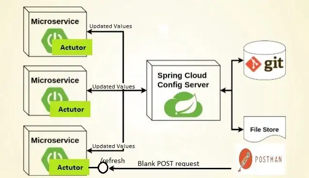

In micro-service world, managing configurations of each service separately is a tedious and time-consuming 
task. In other words, if there are many number of modules, and managing properties for each module with the 
traditional approach is very difficult.

## 7.1 Implementation (Spring Cloud Config)

Central configuration server provides configurations (properties) to each microservice connected. 
As mentioned in the above diagram, Spring Cloud Config Server can be used as a central cloud config server 
by integrating to several environments.

Link to Spring Cloud Config examples:
<br>
[Microservices using SpringBoot | Full Example (YouTube/DailyCodeBuffer)](https://www.youtube.com/watch?v=BnknNTN8icw&t=3750s)
<br>

## 8. Distributed Tracing

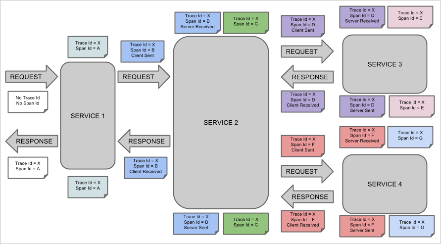

Distributed Tracing is the process of tracing every single request from the point of origin up to 
all the services it touches by analyzing the data. 
Every request will have a Trace ID, timestamp, and other useful metadata.

## 8.1 Implementation (Spring Cloud Sleuth & Zipkin)

Spring Cloud Sleuth allows you to aggregate and track log entries as requests move through a 
distributed software system by adding trace and Span ID’s on the appropriate HTTP request headers.

Zipkin is an open source project that provides mechanisms for sending, receiving, storing, and 
visualizing traces. This allows us to correlate activity between servers and get a much clearer picture of 
exactly what is happening (by using the UI) in our services.

Link to Sleuth & Zipkin examples:
<br>
[Spring Boot Microservices Project Example - Part 7 | Distributed Tracing (YouTube/ProgrammingTechie)](https://www.youtube.com/watch?v=0TQliqoX6Kc&list=PLSVW22jAG8pBnhAdq9S8BpLnZ0_jVBj0c&index=7)
<br>

## 9. Message Brokers / Queues

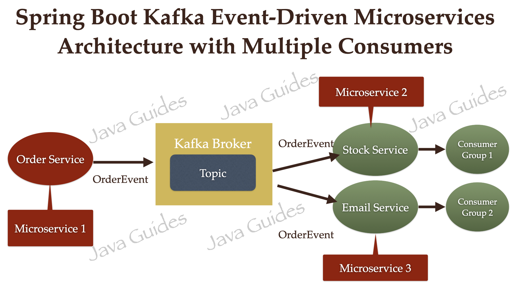

Event-driven architecture (EDA) is a software design pattern in which decoupled applications can asynchronously 
publish and subscribe to events via an event broker/message broker.
In an Event-Driven Architecture, applications communicate with each other by sending and/or receiving 
events or messages.

## 9.1 Implementation (Kafka, RabbitMQ)

In the above architecture, OrderService, StockService, and EmailService microservices are independent of each other. 
OrderService is a Producer (and Topic) application that sends an event to the Message Broker. 
StockService and EmailService are Consumers who will consume the events from the Message Broker.

In this tutorial, we will also see how multiple consumers will subscribe to a single Kafka topic to 
consume the events/messages.

Link to Kafka examples:
<br>
[Kafka Tutorial - Spring Boot Microservices (YouTube/AmigosCode)](https://www.youtube.com/watch?v=SqVfCyfCJqw)
<br>
[Event-Driven Microservices using Spring Boot and Kafka (javaguides)](https://www.javaguides.net/2022/07/event-driven-microservices-using-spring-boot-and-apache-kafka.html)

## B. Deploying Microservices

## 1. Packaging / Containerizing the Application

One question that a lot of beginning programmers have is: "Now that I’ve created my application in the IDE, how do I get it to work from the command line outside of the IDE." Similarly, someone might ask, "How do I distribute this application to other users without having to give them the whole IDE as well?"

We will package the application in the form of an executable JAR file.

A JAR file is an archive file that can contain multiple files and folders. JAR files are similar to zip files, but JAR files can have additional attributes that are useful for distributing Java applications. These attributes include digitally signing JAR files, additional compression, multiplatform compatibility, etc.

Firstly, we need to package our Java application into a jar file via:

``` shell
$> mvn clean package
```

This will create an executable .jar file of our application in the target folder.

We can even start the Spring Boot application with the command:
``` shell
$> java -jar target/<jar-file-name>.jar
```

Now that we have packaged the application, we can think about containerizing it.

## 1.1 Docker

[Docker CLI Cheat Sheet (PDF)](docker_cheatsheet.pdf)
<br>
Installing Docker: [How to Install Docker on Mac (2022) (YouTube/AmitThinks)](https://www.youtube.com/watch?v=SGmFGYCuJK4)
<br>

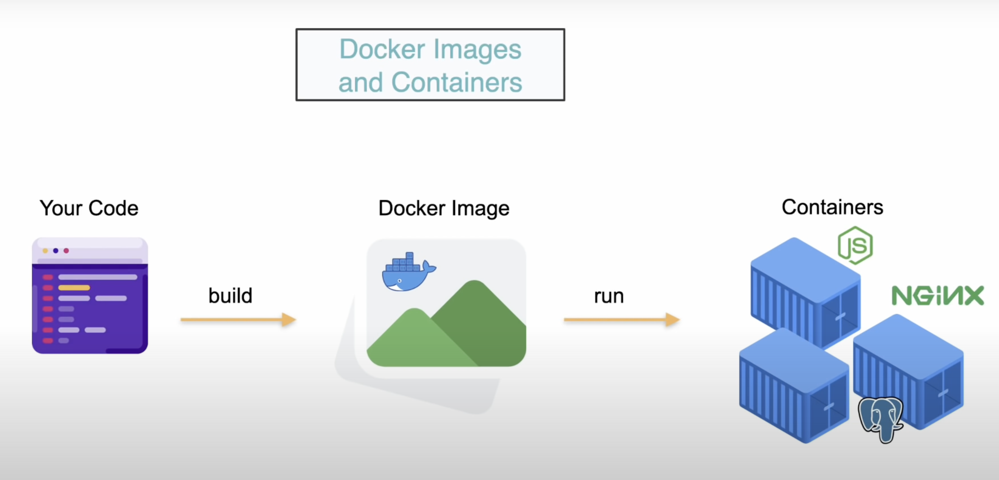

Docker is a (Open Source) platform for building, running and shipping applications. 
Developers can easily build and deploy applications running in containers.
Containers are running instances of our application.
Greatest thing about Docker is the local development is the same across any environment. 
Docker is used alot for CI/CD workflows and DevOps space.

Containers can be spun up from that single Docker image.
Analogy: Docker Image = Class, Container = Instance of that class (Object).
This deployment is made easier with tools such as Jenkins
Jenkins is a platform for creating a Continuous Integration/Continuous Delivery (CI/CD) environment.

Docker image is a file used to execute code in a Docker Container.
Set of instruction to build a Docker Container.
Contains the application code libraries, tools and everything needed to run your application.
Can think of the Docker image as the blueprint.
And from the Blueprint, we can run multiple instances of the containers.

A container is an isolated environment for running an application.
It contains everything your application needs.
It is the smallest deployable unit for Docker.


## 1.1.1 Dockerfile

Application converted to Docker images via dockerfile.

To dockerize an application, we first create a file named Dockerfile with the following content:

``` dockerfile
FROM openjdk:11-jdk
ARG JAR_FILE=target/*.jar
COPY ${JAR_FILE} /app.jar
ENTRYPOINT ["java","-jar","/app.jar"]
```

This file contains the following information:

- FROM: As the base for our image, we'll take the Java-enabled Alpine Linux created in the previous section.
- ARG: Defines the parameter name and defines its default value.
- COPY: We let Docker copy our jar file into the image.
- ENTRYPOINT: This will be the executable to start when the container is booting. We must define them as JSON-Array because we'll use an ENTRYPOINT in combination with a CMD for some application arguments.

To create an image from our Dockerfile, we have to run ‘docker build' like before:

``` shell
$> docker build --tag=message-server:latest .
```

Finally, we're able to run the container from our image:

``` shell
$> docker run -p8887:8888 message-server:latest
```

This will start our application in Docker, and we can access it from the host machine at 
localhost:8887/messages. 
Here it's important to define the port mapping, which maps a port on the host (8887) to the port 
inside Docker (8888). 
This is the port we defined in the properties of the Spring Boot application.

NOTE: Can reduce the size of docker image using layers, for example:

``` dockerfile
FROM adoptopenjdk:11-jre-hotspot as builder
WORKDIR extracted
ADD target/*.jar app.jar
RUN java -Djarmode=layertools -jar app.jar extract

FROM adoptopenjdk:11-jre-hotspot
WORKDIR application
COPY --from=builder extracted/dependencies/ ./
COPY --from=builder extracted/spring-boot-loader/ ./
COPY --from=builder extracted/snapshot-dependencies/ ./
COPY --from=builder extracted/application/ ./
EXPOSE 8080
ENTRYPOINT ["java", "org.springframework.boot.loader.JarLauncher"]
```

## 1.1.2 Docker Compose

Docker commands and Dockerfiles are particularly suitable for creating individual containers. However, if we want to operate on a network of isolated applications, the container management quickly becomes cluttered.

To solve this, Docker provides a tool named Docker Compose. This tool comes with its own build-file in YAML format, and is better suited for managing multiple containers.

- Must configure all the docker containers for each service/image in the Microservice application
- Mongo, KeyCloak, Zookeeper & Kafka, KeyCloak & MySQL, Zipkin, Eureka Server, all SB apps need docker-compose configs
- application-docker.properties

an example of two applications running in different Docker containers.
We can combine the configuration for both services in one file called docker-compose.yml:

``` yaml
version: '2'
services:
    message-server:
        container_name: message-server
        build:
            context: docker-message-server
            dockerfile: Dockerfile
        image: message-server:latest
        ports:
            - 18888:8888
        networks:
            - spring-cloud-network
    product-server:
        container_name: product-server
        build:
            context: docker-product-server
            dockerfile: Dockerfile
        image: product-server:latest
        ports:
            - 19999:9999
        networks:
            - spring-cloud-network
networks:
    spring-cloud-network:
        driver: bridge
```

Before we continue, we'll check our build-file for syntax-errors:

``` shell
$> docker-compose config
```

Then we can build our images, create the defined containers, and start it in one command:

``` shell
$> docker-compose up --build
```

This will start up the message-server and product-server in one go.

## 1.1.3 Docker Hub

Docker Hub is a cloud-based repository in which Docker users and partners create, test, store and distribute container images. Through Docker Hub, a user can access public, open source image repositories, as well as use a space to create their own private repositories, automated build functions, webhooks and work groups.

You can pull and push Docker containers to Docker Hub, all you need is a Docker account.

Pull and run a container image from Docker Hub:

to pull the image from Docker Hub, Run: 
``` shell
$> docker pull hello-world
```

to run the image locally, Run:
``` shell
$> docker run hello-world
```

Build and push a container image to Docker Hub from your computer:

Start by creating a Dockerfile to specify your application as shown below:

to build your Docker image, Run:
``` shell
$> docker build -t <your_username>/my-private-repo .
```

to test your Docker image locally, Run:
``` shell
$> docker run <your_username>/my-private-repo
```

to push your Docker image to Docker Hub. You should see output similar to, Run:
``` shell
$> docker push <your_username>/my-private-repo
```

NOTE: Ensure you are logged into Docker by running the command docker login.

## 1.2 Jib

Jib is an open-source Java tool maintained by Google for building Docker images of Java applications.
It simplifies containerization since with it, we don't need to write a dockerfile.

And actually, we don't even have to have docker installed to create and publish the docker images
ourselves.

Docker build flow:

Jib build flow:


Jib organizes your application into distinct layers; dependencies, resources, and classes;
and utilizes Docker image layer caching to keep builds fast by only rebuilding changes.
Jib's layer organization and small base image keeps overall image size small which improves performance and portability.

Implementation: [Dockerizing Spring Boot Apps using Google Jib (YouTube/JavaTechie)](https://www.youtube.com/watch?v=dKXx4O_GIyo)
<br>

NOTE: Configuration for Jib is carried in pom.xml where aside from adding the plugins, you configure the image properties.
<BR>
NOTE: You must provide your Docker credentials in settings.xml file in Maven folder.
<BR>
NOTE: Posts image to DockerHub automatically.

## 2. Managing the Application

## 2.1 Kubernetes

Installing Kubernetes: [How to Install Kubernetes on Mac (YouTube/ResearchRocks)](https://www.youtube.com/watch?v=gFI8PI-gMqQ)
<br>

What is Kubernetes? [Kubernetes in 5 mins YouTube/VMwareCloudNativeApps](https://www.youtube.com/watch?v=PH-2FfFD2PU)
<br>

Kubernetes originated from Google.
Kubernetes (also known as k8s or “kube”) is an open source container orchestration platform that 
automates many of the manual processes involved in deploying, managing, and scaling 
containerized applications.

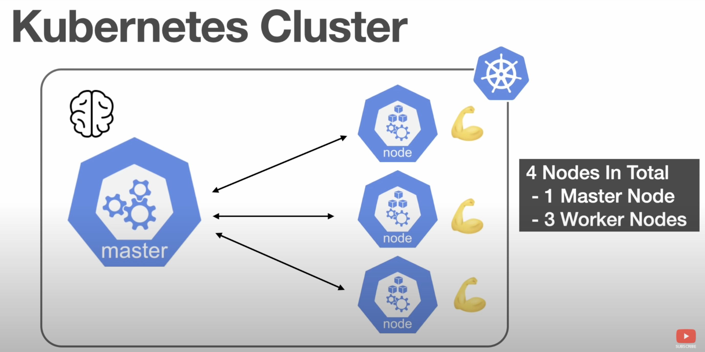

A Cluster is a set of nodes
a Node can be a VM or physical machine.

In the kubernetes cluster there is a master node, and worker nodes.
Master node is the brains and worker nodes do the work
They communicate to eachother via the kubelet

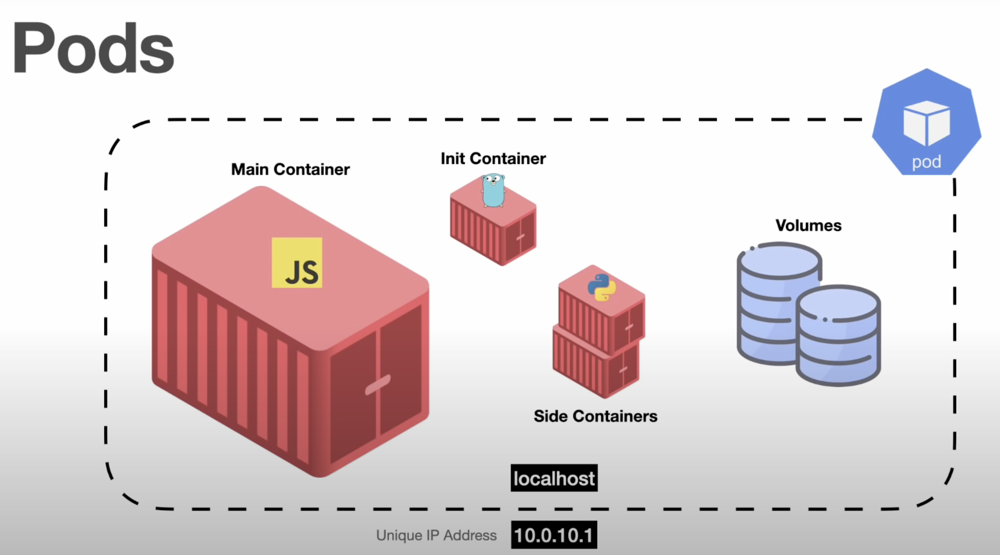

A Pod is the smallest deployable unit (and not containers).
Within a pod you will always have one main container, your application.
You may or may not have init containers (executed before main container).
You may or may not have some side containers (support main container).
We can have volumes, this is how containers share data between them.
So, a Pod is a group of 1 or more containers.
It represents a running process
Shares network and Volumes.
NEVER create PODs on its own, use Controllers instead!


How to use Kubernetes?

