# spring-boot-microservices

This project is a guide to learning how to build, deploy and manage Microservices 
using Spring Boot, Docker and Kubernetes.

## Table of Contents

[A. Building Microservices](#a-building-microservices)
<br>
[1. Building REST Services](#1-building-the-services)
<br>
[2. Communication between Microservices](#2-communication-between-microservices)
<br>
&nbsp;&nbsp;&nbsp;&nbsp;&nbsp;[2.1 Synchronous Communication](#21-synchronous-communication)
<br>
&nbsp;&nbsp;&nbsp;&nbsp;&nbsp;[2.2 Asynchronous Communication](#22-asynchronous-communication)
<br>
&nbsp;&nbsp;&nbsp;&nbsp;&nbsp;[2.3 Implementation (WebClient, OpenFeign)](#23-implementation-webclient-openfeign)
<br>
[3. Service Discovery](#3-service-discovery)
<br>
&nbsp;&nbsp;&nbsp;&nbsp;&nbsp;[3.1 Implementation (Eureka)](#31-implementation-eureka)
<br>
[4. API Gateway](#4-api-gateway)
<br>
&nbsp;&nbsp;&nbsp;&nbsp;&nbsp;[4.1 Implementation (Spring Cloud Gateway)](#41-implementation-spring-cloud-gateway)
<br>
[5. Security](#5-security)
<br>
&nbsp;&nbsp;&nbsp;&nbsp;&nbsp;[5.1 Implementation (Keycloak)](#51-implementation-keycloak)
<br>
[6. Circuit Breaker](#6-circuit-breakers)
<br>
&nbsp;&nbsp;&nbsp;&nbsp;&nbsp;[6.1 Implementation (Resilience4J, Hystrix)](#61-implementation-resilience4j-hystrix)
<br>
[7. Centralize Configuration](#7-centralize-configuration)
<br>
&nbsp;&nbsp;&nbsp;&nbsp;&nbsp;[7.1 Implementation (Cloud Config)](#71-implementation-spring-cloud-config)
<br>
[8. Distributed Tracing](#8-distributed-tracing)
<br>
&nbsp;&nbsp;&nbsp;&nbsp;&nbsp;[8.1 Implementation (Spring Cloud Sleuth & Zipkin)](#81-implementation-spring-cloud-sleuth--zipkin)
<br>
[9. Message Brokers/Queues](#9-message-brokers--queues)
<br>
&nbsp;&nbsp;&nbsp;&nbsp;&nbsp;[9.1 Implementation (Kafka, RabbitMQ)](#91-implementation-kafka-rabbitmq)

[B. Deploying Microservices](#b-deploying-microservices)
<br>
[1. Packaging / Containerizing the Application](#1-packaging--containerizing-the-application)
<br>
&nbsp;&nbsp;&nbsp;&nbsp;&nbsp;[1.1 Docker](#11-docker)
<br>
&nbsp;&nbsp;&nbsp;&nbsp;&nbsp;&nbsp;&nbsp;&nbsp;&nbsp;&nbsp;[1.1.1 Dockerfile](#111-dockerfile)
<br>
&nbsp;&nbsp;&nbsp;&nbsp;&nbsp;&nbsp;&nbsp;&nbsp;&nbsp;&nbsp;[1.1.2 Docker Compose](#112-docker-compose)
<br>
&nbsp;&nbsp;&nbsp;&nbsp;&nbsp;&nbsp;&nbsp;&nbsp;&nbsp;&nbsp;[1.1.3 Docker Hub](#113-docker-hub)
<br>
&nbsp;&nbsp;&nbsp;&nbsp;&nbsp;[1.2 Jib](#12-jib)
<br>
[2. Managing the Application](#2-managing-the-application)
<br>
&nbsp;&nbsp;&nbsp;&nbsp;&nbsp;[2.1 Kubernetes](#21-kubernetes)
<br>

## A. Building Microservices

<ins>Summary

In simple terms, a monolithic application is built as a single unified unit while a microservices 
architecture is a collection of smaller, independently deployable services.

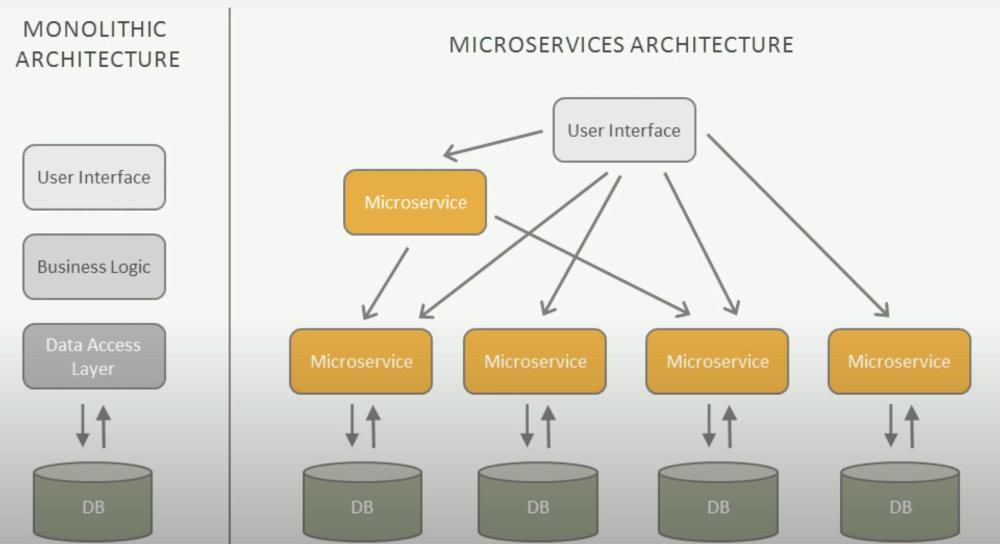

<ins>Monolithic Architecture

The monolithic architecture is considered to be a traditional way of building applications. 
A monolithic application is built as a single and indivisible unit. Usually, such a solution comprises a 
client-side user interface, a server side-application, and a database. 
It is unified and all the functions are managed and served in one place.

Normally, monolithic applications have one large code base and lack modularity. 
If developers want to update or change something, they access the same code base. 
So, they make changes in the whole stack at once.

| Strengths | Weaknesses |
|---|---|
| Easy to develop | Less scalability |
| Simple deployment | Inability to adapt to new technologies |
| Uncomplicated testing and debugging | High dependence between functionalities |

<ins>Microservices Architecture

While a monolithic application is a single unified unit, a microservices architecture breaks it down 
into a collection of smaller independent units. 
These units carry out every application process as a separate service. 
So all the services have their own logic and database, as well as perform their specific functions.

Within a microservices architecture, the entire functionality is split up into independently deployable 
modules which communicate with each other through defined methods called APIs.
Each service covers its own scope and can be updated, deployed, and scaled independently.


| Strengths | Weaknesses |
|---|---|
| Independent services | Time and resource-consuming |
| Enables agile development | Complicated deployment |
| Scalable & reliable | Complex testing |


<ins>Deciding between a Monolithic or Microservices Architecture for your project

For choosing a monolithic architecture:

- Small team.
- A simple application.
- No microservices expertise.
- Quick launch.

For choosing a microservices architecture:

- Microservices expertise.
- A complex and scalable application. 
- Enough engineering skills.

<ins>Spring Cloud

Spring Cloud provides many design patterns to help build Microservice applications. 
Here is a typical Microservice application developed using Spring based projects:

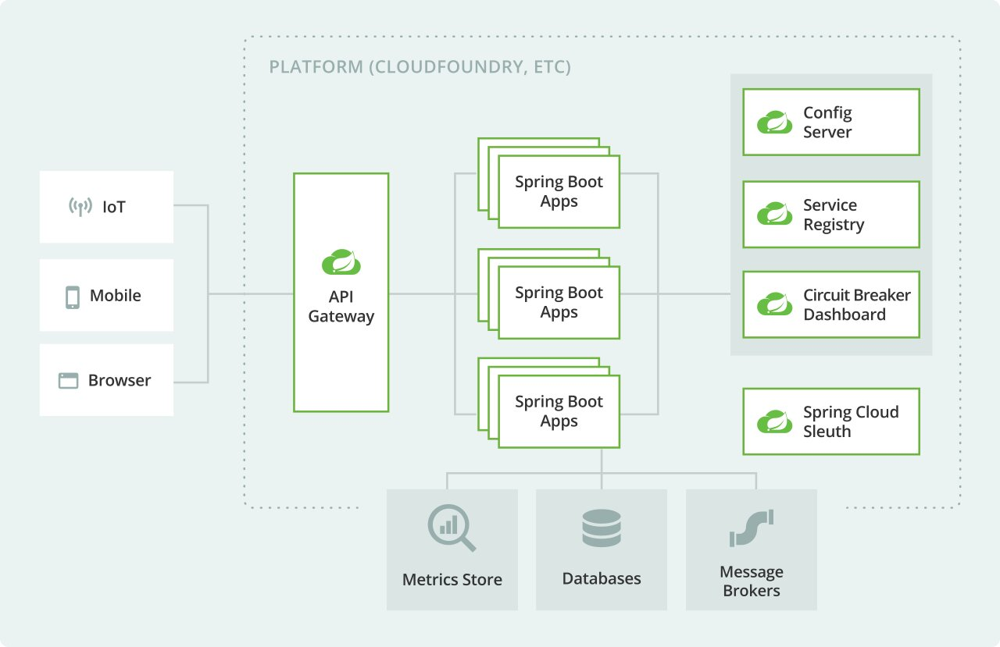

<ins>Supporting Material

[Introduction to Microservices, Docker, and Kubernetes (YouTube/JamesQuigley)](https://www.youtube.com/watch?v=1xo-0gCVhTU)
<br>
[Microservices vs Monolith: which architecture is the best choice for your business? (n-ix.com/RomanaGnatyk)](https://www.n-ix.com/microservices-vs-monolith-which-architecture-best-choice-your-business/)
<br>
[the Basic Microservices Architecture with Spring Cloud (devo.to/BrunoDrugowick)](https://dev.to/brunodrugowick/project-overview-the-basic-microservices-architecture-with-spring-cloud-2e8e)
<br>

## 1. Building the Services

To build the microservices, we must first separate the components that would be present in a 
Monolithic application into smaller, independent applications. 

For example, instead of building a "Store App" with a model, repository, service and so on for 
Product, Order and Inventory... we extract these into their own individual applications.
Here, we will end up with product-service, order-service and inventory-service applications.

The Microservice example application developed in this repository is based on the architecture below
and comes from [Spring Boot Microservices Full Course (YouTube/ProgrammingTechie)](https://www.youtube.com/playlist?list=PLSVW22jAG8pBnhAdq9S8BpLnZ0_jVBj0c):

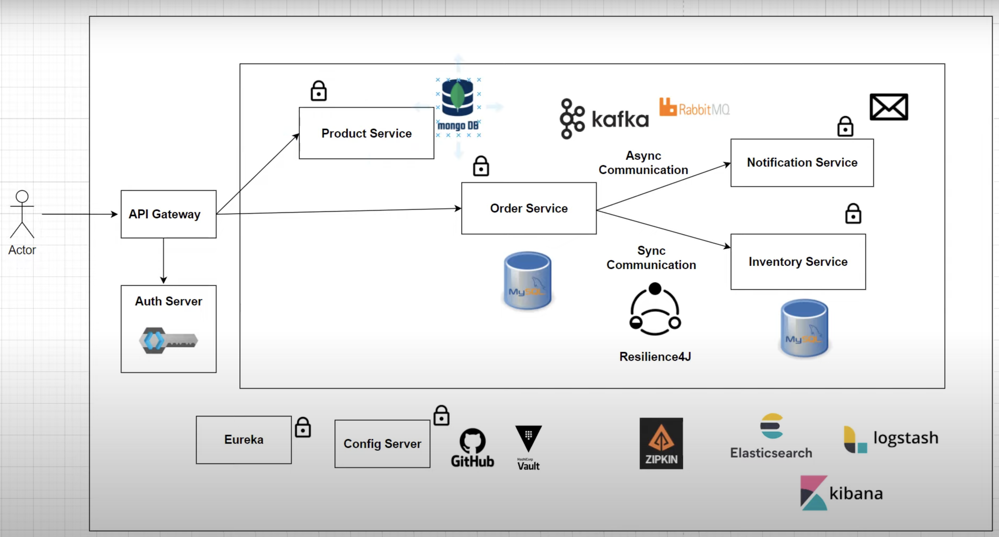

We must not forget to carry out appropriate tests for each microservice, this is typically carried out in 
the form of integration tests.
For testing, we can make use of Testcontainers which allows us to run JUnit tests in lightweight throwaway 
instances of databases that can be run in Docker containers!

Furthermore, it will be more functional to adopt a Maven multi-module project to manage the 
microservices/applications more easily.

<ins>Supporting Material

[Spring Boot Microservices Level 1: Communication and Discovery (YouTube/JavaBrains)](https://www.youtube.com/playlist?list=PLqq-6Pq4lTTZSKAFG6aCDVDP86Qx4lNas)
<br>

## 2. Communication between Microservices

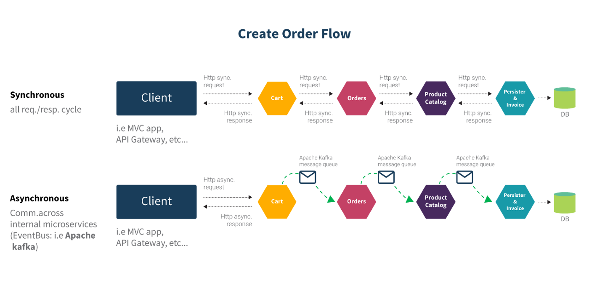

If you are working with a Spring Boot project which involves multiple microservices, 
You might have felt the need to communicate from one microservice to another. 
Depending upon business use-cases, this communication can be of synchronous or asynchronous type.

<ins>Supporting Material

Link to: [Spring Boot Microservices Level 1: Communication and Discovery (YouTube/JavaBrains)](https://www.youtube.com/playlist?list=PLqq-6Pq4lTTZSKAFG6aCDVDP86Qx4lNas)
<br>

## 2.1 Synchronous Communication

In the case of Synchronous Communication, the client sends a request and waits for a response from the service. 
The important point here is that the protocol (HTTP/HTTPS) is synchronous and the client code can only continue 
its task when it receives the HTTP server response.

An example of where this might be used is in an e-commerce application, if a customer searches for a particular 
product to purchase, then that product’s availability needs to be validated in the inventory by making a request 
to the product availability service. 
Why? Because the customer must know about the current availability of the product before placing the order.
In this case, you use synchronous communication to get the product’s real-time availability 
in inventory and price information.

For Synchronous Communication: Can make use of REST Template, OpenFeign or WebClient.

## 2.2 Asynchronous Communication

In the case of Asynchronous Communication, the client sends a request and does not wait for a response from the service. 
The client will continue executing its task - It does not wait for the response from the service.

An example of where this might be used is in the banking domain, a loan request should be processed and needs approval at multiple levels. 
So in this case, when a user raises a request for the loan, the loan request service will provide a reference number immediately. 
Once all the approvals are done, the system will persist the loan request details into the database. 
So in this scenario, we can use asynchronous communication.

For Asynchronous Communication: Can make use of Message Brokers / Message Queues such as RabbitMQ and Apache Kafka.

## 2.3 Implementation (WebClient, OpenFeign)

<ins>WebClient

WebClient is an interface representing the main entry point for performing web requests.
It was created as part of the Spring Web Reactive module and has replaced the classic RestTemplate in these scenarios.

Link to WebClient examples: 
<br>
[Calling REST from Java with Spring WebClient (YouTube/vaadinofficial)](https://www.youtube.com/watch?v=-U_dDUAw_OM)
<br>
[Using WebClient to make API calls (YouTube/JavaBrains)](https://www.youtube.com/watch?v=F3uJyeAyv5g)

<ins>OpenFeign

OpenFeign, originally known as Feign and sponsored by Netflix, is designed to allow developers to use a declarative 
way to build HTTP clients by means of creating annotated interfaces without writing any boilerplate code.

Link to OpenFeign examples:
<br>
[Feign Client Using Spring Boot (YouTube/PlayJava)](https://www.youtube.com/watch?v=tlshVRtbS_c)

<ins>Asynchronous Communication

Implementation of Asynchronous Communication is covered in [Section 9. Message Brokers/Queues](#9-message-brokers--queues).

## 3. Service Discovery

Microservices are dynamic in nature. This means that multiple instances of a single Microservice 
can/will be co-existing. 
It is likely your instances will either have a different IP address, a different port or even both. 
Furthermore, the number of instances will be dynamic too. 

This brings up the questions:
- How do I know the location of any Microservice instance?
- How can I keep a track of all the instances?
- How do I select a Microservice instance?
- What happens if the Microservice instance goes down?

When building REST APIs, We are assuming the URL (e.g. http://localhost:8080/product/**) to be constant 
but in reality, it is dynamic. All parts of it — be it the hostname or the port.

Service Discovery solves this problem. It provides a mechanism that keeps track of all the services and their instances. 
All the Microservices register to the Service Discovery and update their network information regularly.

<ins>Client-side Service Discovery

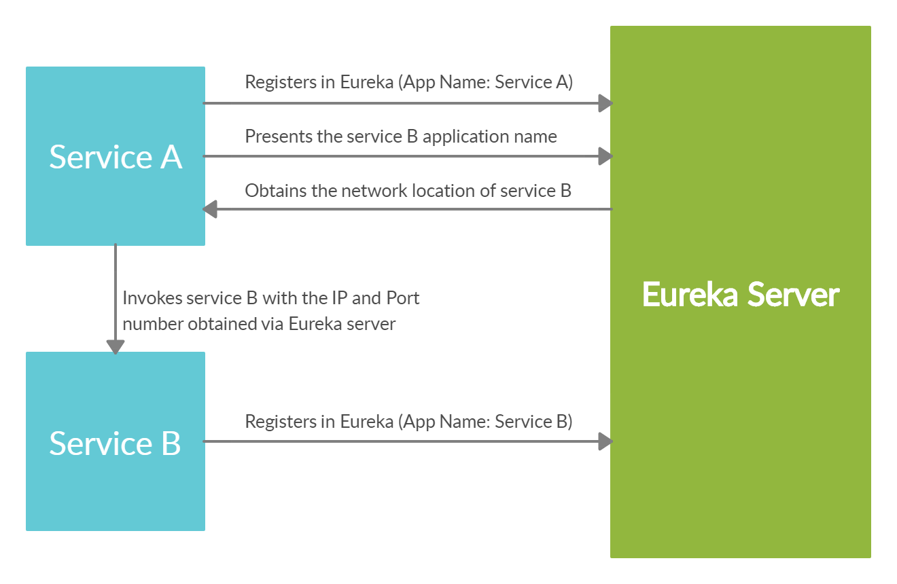

The discovery server will keep a track of all the instances, their hosts, ports, and health status. 
If a service needs to communicate with another service, it needs to get the instance info from this 
discovery server. However, Load balancing is a must as the discovery server does not handle it automatically.

Client-side service discovery allows services to find and communicate with each other without hard-coding
the hostname and port. The only ‘fixed point' in such an architecture is the service registry, with
which each service has to register.

Above describes Client-side Service Discovery but, you can also have Server-side Service Discovery.
Server-side is similar to the option above but the load balancing is not happening at the client side. 
We have a dedicated proxy server that takes care of this.

<ins>Supporting Material

[Spring Boot Microservices Level 1: Communication and Discovery (YouTube/JavaBrains)](https://www.youtube.com/playlist?list=PLqq-6Pq4lTTZSKAFG6aCDVDP86Qx4lNas)
<br>
[Spring Boot Microservices — Developing Service Discovery (Medium/LalVerma)](https://lalverma.medium.com/spring-boot-microservices-implementing-service-discovery-cfc98e49b74f)

## 3.1 Implementation (Eureka)

<ins>Eureka

We make use of client-side service discovery via “Spring Cloud Netflix Eureka”. 
We must ensure the correct dependencies and configurations are entered on both the Server and Client(s) properties file. 
Load balancing is a must as the discovery server does not handle it automatically, so this must also be configured.

Link to Eureka examples:
<br>
[Spring Boot Microservices Project Example - Part 3 | Service Discovery (YouTube/ProgrammingTechie)](https://www.youtube.com/watch?v=0TQliqoX6Kc&list=PLSVW22jAG8pBnhAdq9S8BpLnZ0_jVBj0c&index=3)

## 4. API Gateway

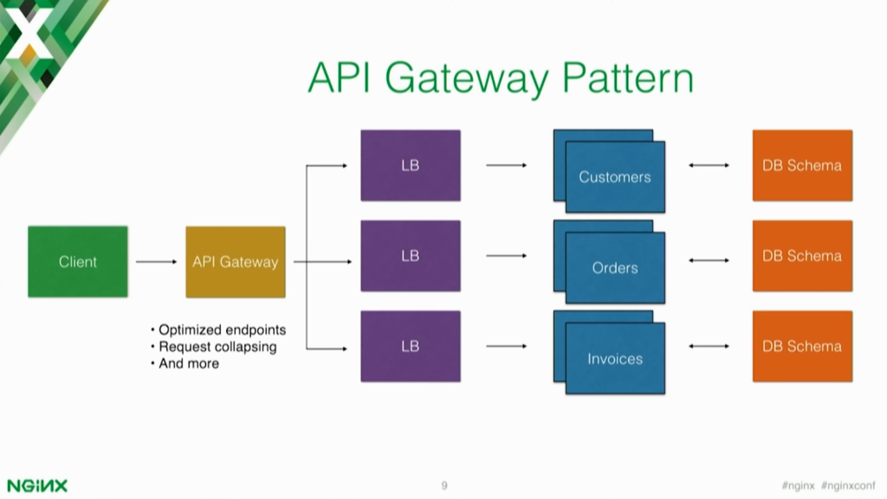

An API gateway is the single entry point for all clients. The API gateway handles requests in one of two ways,
some requests are simply proxied/routed to the appropriate service while others
are spread to multiple services.

Rather than provide a one-size-fits-all style API, the API gateway can expose a different API for each client.
For example, the Netflix API gateway runs client-specific adapter code that provides each client with an API
that’s best suited to its requirements.

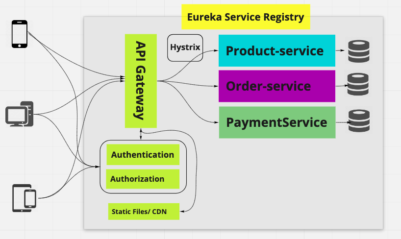

The API gateway might also implement security, e.g. verify that the client is authorized to perform the request.

## 4.1 Implementation (Spring Cloud Gateway)

<ins>Spring Cloud Gateway

Spring Cloud Gateway provides a library for building API gateways on top of Spring and Java. 
It provides a flexible way of routing requests based on a number of criteria, as well as focuses on 
cross-cutting concerns such as security (authentication), resiliency (load balancing), and monitoring.

Link to Spring Cloud Gateway examples:
<br>
[Spring Boot Microservices Project Example - Part 4 | API Gateway (YouTube/ProgrammingTechie)](https://www.youtube.com/watch?v=0TQliqoX6Kc&list=PLSVW22jAG8pBnhAdq9S8BpLnZ0_jVBj0c&index=4)

## 5. Security

An important aspect of securing your applications is authorization and access to the API resources. 
If you think about web app authorization, the first approach that probably comes to your mind is OAuth 2.0 
or OpenID Connect. OAuth 2.0 is the industry-standard protocol for authorization. 
Of course, it is supported by Spring Security. 
There are also multiple OAuth2 providers (Google, Github, etc.) you can integrate your application with. One of them is Keycloak.

## 5.1 Implementation (Keycloak)

<ins>Keycloak

Keycloak is an open-source identity and access management solution which makes it easy to secure modern applications  with less code.
Keycloak is based on standard protocols and provides support for OpenID Connect, OAuth 2.0, and SAML.
Building an application that is integrated with Keycloak will provide you a more secure and stable solution.

You can enable and configure OAuth 2.0 support on the API gateway via Keycloak running in a Docker container. 
But, we must ensure that configurations such as Issuer URI and SecurityConfig.class are added.
When using POSTMAN for communicating with the REST API's, we must select OAuth2.0
in "Authorization Type" and complete the configuration options as per our KeyCloak settings.
This will allow us to use JWT's issued by KeyCloak.

Link to Keycloak examples:
<br>
[Spring Boot Microservices Project Example - Part 5 | Security (YouTube/ProgrammingTechie)](https://www.youtube.com/watch?v=0TQliqoX6Kc&list=PLSVW22jAG8pBnhAdq9S8BpLnZ0_jVBj0c&index=5)
<br>
[Securing Spring Boot Microservices with Keycloak using OpenID | OAuth2.0 (YouTube/JavaTechie)](https://www.youtube.com/watch?v=La082JsJoH4)
<br>

## 6. Circuit Breakers

In Microservices, an application or service can make many remote calls to applications running in different services, 
usually on different machines across a network. If there are many callers to an unresponsive service, you 
can run out of critical resources leading to cascading failures across multiple systems.

Consider an example that multiple users log-in to a banking application and the account service is down. 
The authentication service will wait on the account service and now many user threads are waiting for 
a response, thereby exhausting the CPU on the authentication service as well as the account service. 
As a result, the system cannot serve any of the users.

Circuit Breakers are a design pattern to create resilient microservices by limiting the impact of service 
failures and latencies. The major aim of the Circuit Breaker pattern is to prevent any cascading failure in 
the system. In a microservice system, failing fast is critical.

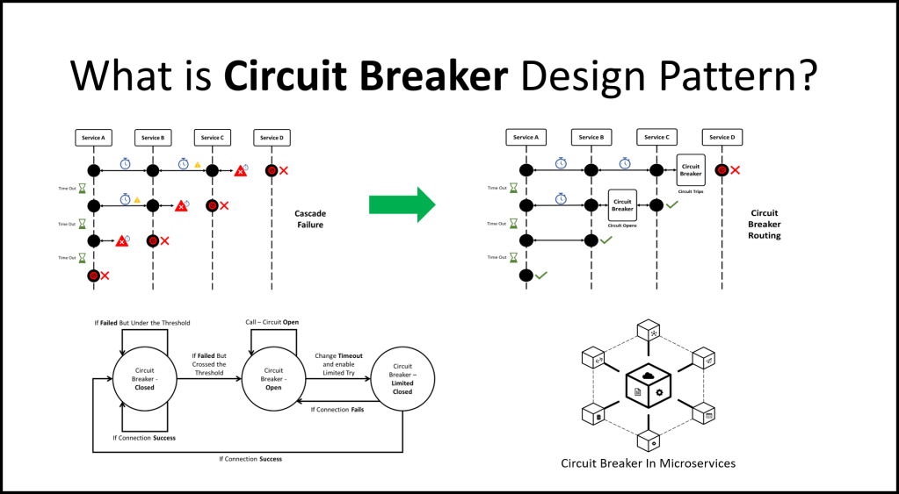

In the Circuit Breaker, there are 3 states: Closed, Open, and Half-Open. These different states are triggered
based on the configurations we have set. There are 2 types of circuit breaker patterns, Count-based and Time-based.
A count-based circuit breaker switches state from closed to open if the last N number of calls failed or 
were slow. A time-based circuit breaker switches to an open state if the responses in the last N seconds 
failed or were slow.

If there are failures in the Microservice ecosystem, then you need to fail fast by opening the circuit. 
This ensures that no additional calls are made to the failing service and that we can return the fall back logic
(we have implemented in our service) to the client immediately.

<ins>Supporting Material

[Spring Boot Microservices Level 2: Fault Tolerance and Resilience (YouTube/JavaBrains)](https://www.youtube.com/playlist?list=PLqq-6Pq4lTTbXZY_elyGv7IkKrfkSrX5e)
<br>

## 6.1. Implementation (Resilience4J, Hystrix)

Spring Cloud Circuit Breaker supports many circuit breaker implementations including, 
Resilience4J, Hystrix, Sentinal, and Spring Retry. 
In this guide we will be using the modern alternative to Hystrix, Resilience4J.

<ins>Resilience4J

Resilience4J is a lightweight fault tolerance library inspired by Netflix Hystrix, but designed for 
functional programming. 
Resilience4J provides higher-order functions (decorators) to enhance any functional interface, 
lambda expression or method reference with a Circuit Breaker, Rate Limiter, Retry or Bulkhead.

Link to Resilience4J examples:
<br>
[Spring Boot Microservices Project Example - Part 6 | Resilience4J Circuit Breaker (YouTube/ProgrammingTechie)](https://www.youtube.com/watch?v=0TQliqoX6Kc&list=PLSVW22jAG8pBnhAdq9S8BpLnZ0_jVBj0c&index=6)
<br>

## 7. Centralize Configuration

Configuration is essential for any production application as it is required for establishing connections,
storing credentials, configuring Spring Cloud properties and so on.

We must not write any configuration logic in the business logic code, but instead, 
separate them and add the config into files such as application.properties.
This is done so any property values can be easily set, located or changed.

Previously, XML was the favoured filetype for storing application properties, however formats such as .properties, 
.yaml and .json are now preferred as they are significantly less verbose.

<ins>Externalise Configuration

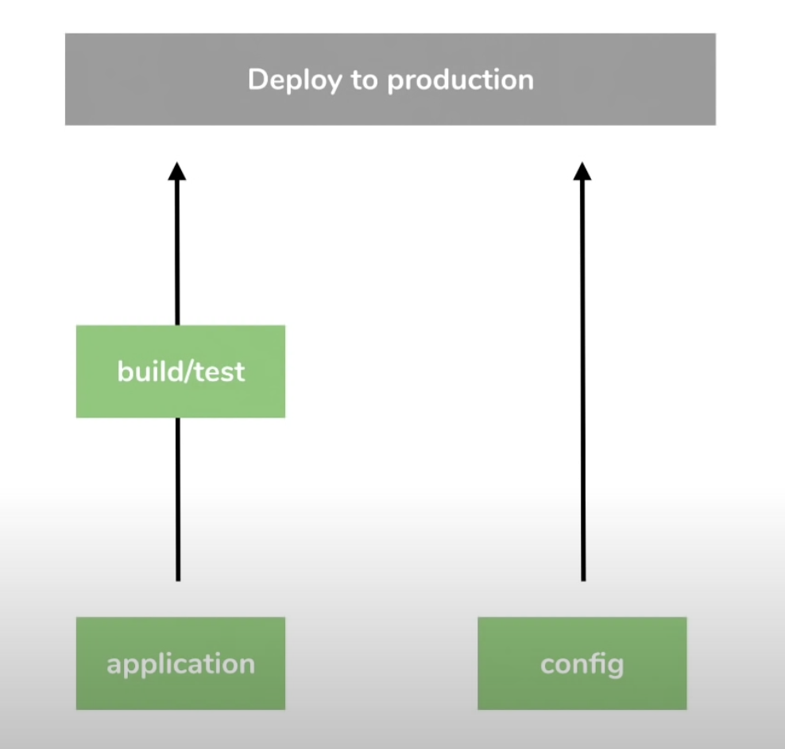

From a deployment perspective, it is not necessary to go through the process of rebuilding/testing the application
when changes are made to the config file(s). It is much more efficient to simply separate and externalize
configuration. 

Spring Boot by default uses application.properties as its config file however, application.yml supports nesting through
indentations and reduces duplication when it comes to key name paths. 

<ins>Spring Profiles

In Spring, we can specify which environment (DEV, PROD etc.) we want to run the application based on 
the config file and app names.
Naming the config files based on environment follows the format:
```
application-<environmentName>.extn
```

To have environment based config while still having everything packaged within the .jar file:
```
java -jar <jar-name>.jar --spring.profiles.active=test
```

This means we can have multiple application-environment.yml config files saved in the project directory, packaged into 
the .jar file, without stating the active Spring profile, and we can specify which environment to run the application in.

<ins>Spring Cloud Config

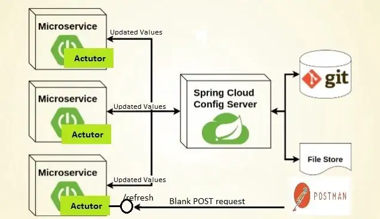

In the Microservices world, managing configurations of each service separately is a tedious and time-consuming 
task. Imagine each service has their own config file, and there are also multiple instances of each service,
managing properties for each module with the traditional approach is very difficult.
A Central configuration server provides configurations (properties) to each microservice connected and handles this
problem more efficiently.

What is required is a repository that holds the configuration files and can be connected to the Spring Cloud Config 
Server. We can use Git for this.
In doing this, no application re-build is required if any changes are made to any of these files. 
When using a Git Repo, we can commit any changes to the config files and push them to the remote repository directly.

The goal of centralizing configuration is to:
- Externalize configuration
- Allow environment specificity (DEV, PROD, TEST)
- Maintain consistency (configuration between services)
- Track version history
- Adopt real-time management (make changes to configuration while services are still running!)

<ins>Supporting Material

[Spring Boot Microservices Level 3: Microservice configuration (YouTube/JavaBrains)](https://www.youtube.com/playlist?list=PLqq-6Pq4lTTaoaVoQVfRJPqvNTCjcTvJB)
<br>

## 7.1 Implementation (Spring Cloud Config)

<ins>Spring Cloud Config Server

We need to:
- Add Spring Cloud Config Server dependency
- Add @EnableConfigServer annotation
- Configure git URI in application.properties file 
- Specify the server.port=8888 (typical for cloud config) 
- Add the Config Clients dependencies
- Spring Cloud Config URI properties 
- Add any microservice specific properties in microservices-name.yml where the name is specified in spring.app.name key.

Link to Spring Cloud Config examples:
<br>
[Set up spring cloud config server from scratch (YouTube/JavaBrains)](https://www.youtube.com/watch?v=gb1i4WyWNK4&list=PLqq-6Pq4lTTaoaVoQVfRJPqvNTCjcTvJB&index=11)
<br>
[Setting up spring cloud config client (YouTube/JavaBrains)](https://www.youtube.com/watch?v=E2HkL766VHs&list=PLqq-6Pq4lTTaoaVoQVfRJPqvNTCjcTvJB&index=12)
<br>
[Dynamic config with spring Boot (YouTube/JavaBrains)](https://www.youtube.com/watch?v=yNnLICy2zk4&list=PLqq-6Pq4lTTaoaVoQVfRJPqvNTCjcTvJB&index=13)
<br>

## 8. Distributed Tracing


Distributed Tracing is the process of tracing every single request from the point of origin up to 
all the services it touches by analyzing the data. 
Every request will have a Trace ID, timestamp, and other useful metadata.

## 8.1 Implementation (Spring Cloud Sleuth & Zipkin)

<ins>Spring Cloud Sleuth

Spring Cloud Sleuth allows you to aggregate and track log entries as requests move through a 
distributed software system by adding trace and Span ID’s on the appropriate HTTP request headers.

<ins>Zipkin

Zipkin is an open source project that provides mechanisms for sending, receiving, storing, and 
visualizing traces. This allows us to correlate activity between servers and get a much clearer picture of 
exactly what is happening (by using the UI) in our services.

Link to Sleuth & Zipkin examples:
<br>
[Spring Boot Microservices Project Example - Part 7 | Distributed Tracing (YouTube/ProgrammingTechie)](https://www.youtube.com/watch?v=0TQliqoX6Kc&list=PLSVW22jAG8pBnhAdq9S8BpLnZ0_jVBj0c&index=7)
<br>

## 9. Message Brokers / Queues

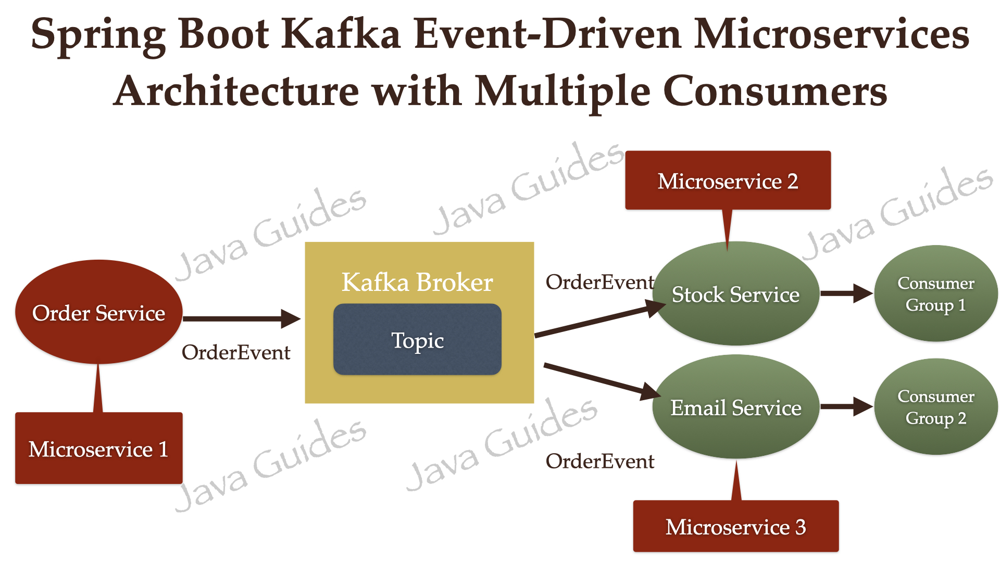

Event-driven architecture (EDA) is a software design pattern in which decoupled applications can asynchronously 
publish and subscribe to events via an event broker/message broker.
In an Event-Driven Architecture, applications communicate with each other by sending and/or receiving 
events or messages.

## 9.1 Implementation (Kafka, RabbitMQ)

<ins>Kafka

In the above architecture, OrderService, StockService, and EmailService microservices are independent of each other. 
OrderService is a Producer application that sends an event to the Message Broker. 
StockService and EmailService are Consumers who will consume the events from the Message Broker.

In the links below, you can see how multiple consumers can subscribe to a single Kafka topic to 
consume the events/messages.

Link to Kafka examples:
<br>
[Event-Driven Microservices using Spring Boot and Kafka (javaguides)](https://www.javaguides.net/2022/07/event-driven-microservices-using-spring-boot-and-apache-kafka.html)
<br>
[Kafka Tutorial - Spring Boot Microservices (YouTube/AmigosCode)](https://www.youtube.com/watch?v=SqVfCyfCJqw)

## B. Deploying Microservices

<ins>Summary of Steps:

Ensure you are in the project directory for the Packaging and Docker steps, and that Docker is running and you are signed-in.

1. Develop Spring Boot Application
2. Package Application (mvn clean package)
3. Build Docker Image (Dockerfile, docker-compose.yaml, Jib)
4. Run Docker Image in Container (for testing, not necessary with k8s deployment)
5. Push Docker Image to Docker Hub and move to Remote Repository (docker push)
6. Start Kubernetes (minikube start)
7. Create Kubernetes Deployment (deployment.yaml)
8. Create Kubernetes Service (service.yaml)
9. Run Deployment and Service (kubectl apply)
10. View k8s Dashboard (minikube dashboard)

[SpringBoot to Kubernetes in 15 minutes (YouTube/TEKE)](https://www.youtube.com/watch?v=aH1IwAPHe1w)
<br>
[Deploy Springboot Microservices to Kubernetes Cluster (YouTube/DailyCodeBuffer)](https://www.youtube.com/watch?v=VAmntTPebKE&t=408s)
<br>

## 1. Packaging / Containerizing the Application

One question that a lot of beginning programmers have is: "Now that I’ve created my application in the IDE, 
how do I get it to work from the command line outside of the IDE." Similarly, someone might ask, 
"How do I distribute this application to other users without having to give them the whole IDE as well?"

We can package the application in the form of an executable JAR file.

A JAR file is an archive file that can contain multiple files and folders. 
JAR files are similar to zip files, but JAR files can have additional attributes that are useful for 
distributing Java applications. These attributes include digitally signing JAR files, additional compression, 
multiplatform compatibility, etc.

Firstly, we need to package our Java application into a jar file using the command:
``` shell
$> mvn clean package
```

This will create an executable .jar file in the "target" folder.
We can even start the Spring Boot application with the command:
``` shell
$> java -jar target/<jar-file-name>.jar
```

Now that we have packaged the application, we can think about containerizing it with Docker.

## 1.1 Docker

Docker Commands: [Docker CLI Cheat Sheet (PDF)](docker_cheatsheet.pdf)
<br>
Installing Docker: [How to Install Docker on Mac (2022) (YouTube/AmitThinks)](https://www.youtube.com/watch?v=SGmFGYCuJK4)
<br>

Docker is an open platform for building, running and shipping applications. 
It allows developers to easily build and deploy applications in containers.

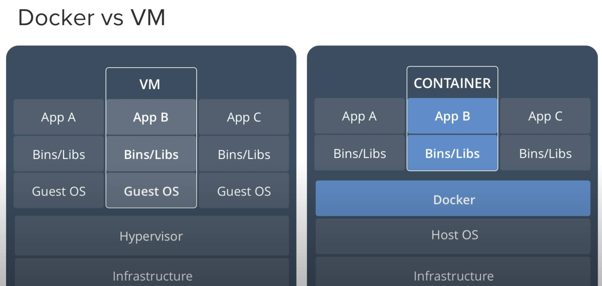

<ins>Benefits of Docker include:
- A Docker container image is a lightweight, standalone, executable package of software that includes everything needed to run an application.
- As there is no OS involved, an application that operates in a container will behave the same in any container environment.
- When compared with VM's, they take up less space, require less time to deploy and can handle more applications.
- It can run on physical hardware, virtual hardware and on cloud.
- Docker is used a lot for CI/CD workflows in the DevOps space. 
It works well as part of its pipelines along with tools such as Jenkins. 
These tools can save the new version as a Docker image, every time our source code is updated, 
just tag it with an updated version number and push to Docker Hub, then deploy it to production automatically.

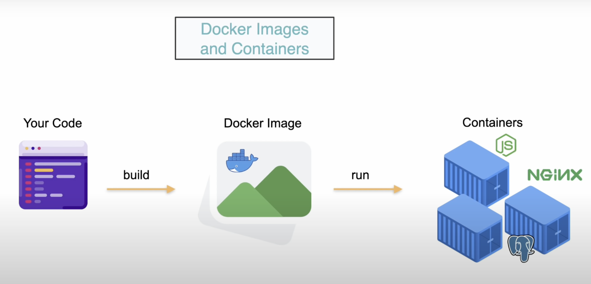

<ins>What is an Image?

- Docker image is a file used to execute code in a Docker Container.
- Docker images act as a set of instructions to build a Docker container, like a template.
- Contains the application code libraries, tools and everything needed to run your application.
- From this template, we can run multiple instances of the image(s) in containers.

<ins>What is a Container?

- A container is an isolated environment for running an application.
- They contain everything your application needs 
- They are running instances of our application.
- It is also the smallest deployable unit for Docker.
- Multiple containers can be spun up from a single Docker image.
- To compare it to OOP, you can think of a Docker Image as a Class, and a Container as an instance of that Class (Object).
- This deployment is made easier with tools such as Jenkins, which is a platform for creating a Continuous Integration/Continuous Delivery (CI/CD) environment.

## 1.1.1 Dockerfile

Your packaged application code is converted to a Docker Image via a Dockerfile.
A Dockerfile is a text document that contains all the commands a user could call on the command line to assemble an image.
To dockerize an application, we first create a file named Dockerfile with the following content:

Dockerfile:
``` dockerfile
FROM openjdk:11-jdk
ARG JAR_FILE=target/*.jar
COPY ${JAR_FILE} /app.jar
ENTRYPOINT ["java","-jar","/app.jar"]
```

another example Dockerfile:
``` dockerfile
FROM openjdk:8
EXPOSE 8080
ADD target/springboot-k8s-demo.jar springboot-k8s-demo.jar
ENTRYPOINT ["java","-jar","/springboot-k8s-demo.jar"]
```

These files contain the following information:

- FROM: specifies the Parent Image from which you are building (the base image).
- ARG: Defines the parameter name and defines its default value.
- COPY:  copies files from a local source location to a destination in the Docker container.
- ADD: used to copy files/directories into a Docker image.
- EXPOSE: tells Docker that a container listens for traffic on the specified port.
- ENTRYPOINT: used to set executables that will always run when the container is initiated.

<ins>Building a Docker Image

To build an image from our Dockerfile, we have to run ‘docker build' in the command line. 

**Ensure Docker is running, you are logged in AND you are in the project directory**

format = docker build tag <repository-name>:<tag-version> directory
``` shell
$> docker build -t message-server:latest .
```

We can check if the image is present in our docker local repository:
``` shell
$> docker images
```

Finally, we're able to run a container from our image by providing the image name and tag:
``` shell
$> docker run -p8887:8888 message-server:latest
```

This will start our application in Docker, and we can access it from the host machine at
localhost:8887/messages.
Here it's important to define the port mapping, which maps a port on the host (8887) to the port
inside Docker (8888).
This is the port we defined in the properties of the Spring Boot application.

We can view running containers or all containers with:
``` shell
$> docker ps
$> docker ps -a
```

Now that the Docker image has been created and is running in a container, 
we can now deploy it on a Kubernetes cluster.

More Docker commands available at: [Docker CLI Cheat Sheet (PDF)](docker_cheatsheet.pdf)

<ins>Layered Jars in Docker

We can reduce the size of a docker image by splitting the application into layers.
This is done by modifying the Dockerfile to run a command that extracts and copies these application layers.
With this configuration, when we change our source code, we'll only rebuild the application layer.
The rest will remain cached.

Dockerfile.layered:
``` dockerfile
FROM adoptopenjdk:11-jre-hotspot as builder
WORKDIR extracted
ADD target/*.jar app.jar
RUN java -Djarmode=layertools -jar app.jar extract

FROM adoptopenjdk:11-jre-hotspot
WORKDIR application
COPY --from=builder extracted/dependencies/ ./
COPY --from=builder extracted/spring-boot-loader/ ./
COPY --from=builder extracted/snapshot-dependencies/ ./
COPY --from=builder extracted/application/ ./
EXPOSE 8080
ENTRYPOINT ["java", "org.springframework.boot.loader.JarLauncher"]
```

As we have kept the original "Dockerfile" file from previous, instead of overwriting its contents
we can create an image from the new file "Dockerfile.layered".
When building this new image however,
we must specify the filename in the command line so Docker does not by default automatically search for and build the "Dockerfile" file instead.

To build a docker image from a specified Dockerfile file:
``` shell
docker build -t arsy786/fcms-layered -f Dockerfile.layered .
```

We can see the significant difference in size between the two images:

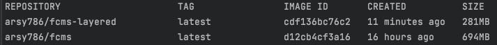

## 1.1.2 Docker Compose

Docker commands and Dockerfiles are particularly suitable for creating individual containers. 
However, if we want to operate on a network of isolated applications, the container management quickly 
becomes cluttered.

To solve this, Docker provides a tool named Docker Compose. This tool comes with its own build-file in 
YAML format, and is better suited for managing multiple containers.

Within the docker-compose.yaml file, we must configure all the docker containers for each service, image and db 
in the Microservice application. For example, Mongo, KeyCloak, Zookeeper & Kafka, KeyCloak & MySQL, Zipkin, 
Eureka Server, and all SB apps need docker-compose configs. 

We must also configure an application.properties for the Docker environment.
Similar to a DEV/PROD profile, to enable environment-specific configuration properties we need to add new application.properties files.
- application-dev.properties
- application-prod.properties
- application-local.properties
- application-test.properties
- application-docker.properties

NOTE: Can make use of Spring Cloud Config Server instead of trying to set up many properties files for each service.

An example of two applications running in different Docker containers,
we can combine the configuration for both services in one file called docker-compose.yaml:

``` yaml
version: '2'
services:
    message-server:
        container_name: message-server
        build:
            context: docker-message-server
            dockerfile: Dockerfile
        image: message-server:latest
        ports:
            - 18888:8888
        networks:
            - spring-cloud-network
    product-server:
        container_name: product-server
        build:
            context: docker-product-server
            dockerfile: Dockerfile
        image: product-server:latest
        ports:
            - 19999:9999
        networks:
            - spring-cloud-network
networks:
    spring-cloud-network:
        driver: bridge
```

Before we continue, you can check the build-file for syntax-errors:

``` shell
$> docker-compose config
```

Then we can build our images, create the defined containers, and start it in one command:

``` shell
$> docker-compose up --build
```

This will start up the message-server and product-server in one go.

## 1.1.3 Docker Hub

Docker Hub is a cloud-based repository in which Docker users and partners create, test, 
store and distribute container images. Through Docker Hub, a user can access public, 
open source image repositories, as well as use a space to create their own private 
repositories, automated build functions, webhooks and work groups.

You can pull and push Docker images to Docker Hub, all you need is a Docker account.

<ins>Pull and run a container image from Docker Hub:

to pull the image from Docker Hub: 
``` shell
$> docker pull hello-world
```

to run the image locally:
``` shell
$> docker run hello-world
```

<ins>Build and push a container image to Docker Hub from your computer:

Start by creating a Dockerfile to specify your application as shown previously:

to build your Docker image:
``` shell
$> docker build -t <your_username>/my-private-repo .
```

to test your Docker image locally:
``` shell
$> docker run <your_username>/my-private-repo
```

to push your Docker image to Docker Hub:
``` shell
$> docker push <your_username>/my-private-repo
```

NOTE: Ensure Docker is running on your machine and that you are logged in by running the command docker login.

## 1.2 Jib

Jib is an open-source Java tool maintained by Google for building Docker images of Java applications.
It simplifies containerization since with it, we don't need to write a dockerfile.
And actually, we don't even have to have docker installed to create and publish the docker images
ourselves.

Docker build flow:

Jib build flow:


Jib organizes your application into distinct layers; dependencies, resources, and classes;
and utilizes Docker image layer caching to keep builds fast by only rebuilding changes.
Jib's layer organization and small base image keeps overall image size small which improves performance and portability.

<ins>Implementation

- Configuration for Jib is carried in pom.xml where aside from adding the plugins, you configure the image properties.
- You must provide your Docker credentials in settings.xml file in Maven folder.
- To use Jib must run the command: mvn compile jib:build 
- Posts image to DockerHub automatically.

Link to Jib examples: 
<br>
[Dockerizing Spring Boot Apps using Google Jib (YouTube/JavaTechie)](https://www.youtube.com/watch?v=dKXx4O_GIyo)
<br>

## 2. Managing the Application

## 2.1 Kubernetes

Installing Kubernetes: [How to Install Kubernetes on Mac (YouTube/ResearchRocks)](https://www.youtube.com/watch?v=gFI8PI-gMqQ)
<br>
What is Kubernetes? [Kubernetes in 5 mins (YouTube/VMwareCloudNativeApps)](https://www.youtube.com/watch?v=PH-2FfFD2PU)
<br>
Link to: [Kubernetes 101: Pods, Nodes, Containers, and Clusters (medium/DanielSanche)](https://medium.com/google-cloud/kubernetes-101-pods-nodes-containers-and-clusters-c1509e409e16)
<br>

<ins>What is Kubernetes?

Kubernetes (also known as k8s or “kube”) is an open source container orchestration platform that 
automates many of the manual processes involved in deploying, managing, and scaling 
containerized applications.

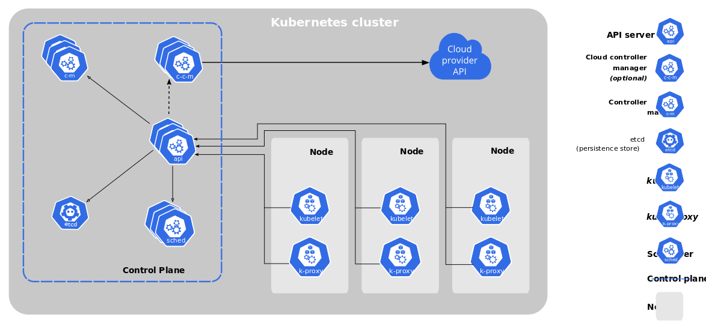

<ins>What is a Kubernetes Cluster?

When you deploy Kubernetes, you get a cluster.

A Kubernetes cluster consists of a set of worker machines, called nodes, that run 
containerized applications. Every cluster has at least one worker node.

The worker node(s) host the Pods that are the components of the application workload. 
The control plane manages the worker nodes and the Pods in the cluster. 
In production environments, the control plane usually runs across multiple computers and 
a cluster usually runs multiple nodes, providing fault-tolerance and high availability.

<ins>What is a Pod?

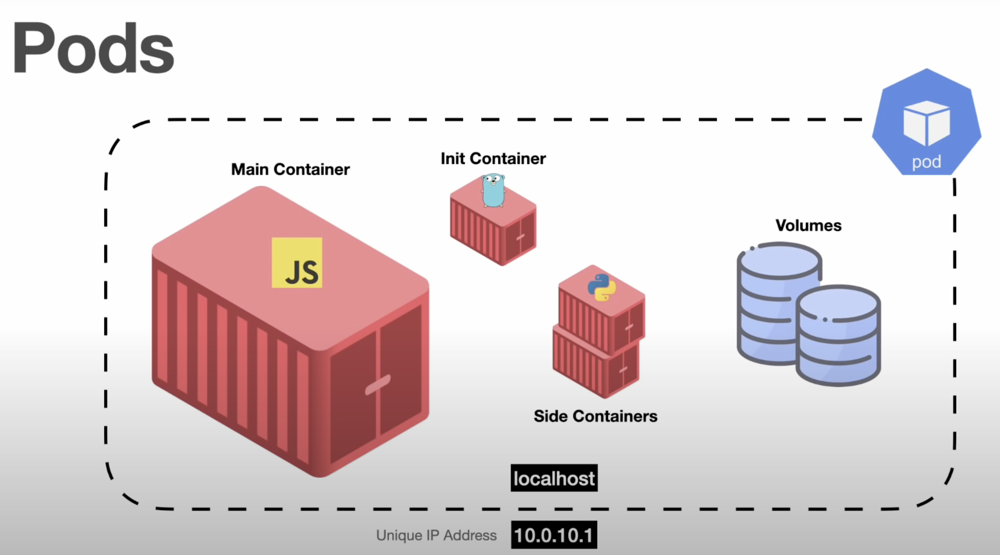

Pods are the smallest, most basic deployable objects in Kubernetes. 
A Pod represents a single instance of a running process in your cluster. 
Pods contain one or more containers, such as Docker containers. 
When a Pod runs multiple containers, the containers are managed as a single entity and share the Pod's resources.

<ins>What is a Volume?

A Volume in Kubernetes represents a directory with data that is accessible across multiple containers in a Pod. 
The container data in a Pod is deleted or lost when a container crashes or restarts, but when you use a volume, 
the new container can pick up the data at the state before the container crashes

<ins>What is a Deployment?

Although pods are the basic unit of computation in Kubernetes, they are not typically directly launched on a cluster. 
Instead, pods are usually managed by one more layer of abstraction: the deployment.

A deployment’s primary purpose is to declare how many replicas of a pod should be running at a time. 
When a deployment is added to the cluster, it will automatically spin up the requested number of pods, 
and then monitor them. If a pod dies, the deployment will automatically re-create it.

Deployments can also help to efficiently scale the number of replica pods, enable the rollout of updated code in a controlled manner, or roll back to an earlier deployment version if necessary.

Using a deployment, you don’t have to deal with pods manually. You can just declare the desired state of the system,
and it will be managed for you automatically.


<ins>deployment.yaml

[Run & Deploy Spring Boot Application in K8s Cluster using yaml configuration (medium/JavaTechie)](https://medium.com/@javatechie/kubernetes-tutorial-run-deploy-spring-boot-application-in-k8s-cluster-using-yaml-configuration-3b079154d232)
<br>

Now that the Docker image is created, we can now deploy it on the Kubernetes cluster.
Next steps to deploy this springboot-k8s-example docker image in to k8s cluster first we need to create deployment 
object.

The best way to make a deployment in K8s is by preparing a YAML file, this file describes configuration about how the
application should run in k8s pod. Or in simple terms, with the help of this deployment configuration we are telling 
k8s to create instances of my spring boot application in k8s cluster.

So let’s define deployment specification. In the root project directory, create a new file named deployment.yaml 
(Note: you can give any name) and add the code snippet below:

``` yaml
apiVersion: apps/v1
kind: Deployment # Kubernetes resource kind we are creating
metadata:
  name: spring-boot-k8s
spec:
  selector:
    matchLabels:
      app: spring-boot-k8s
  replicas: 2 # Number of replicas that will be created for this deployment
  template:
    metadata:
      labels:
        app: spring-boot-k8s
    spec:
      containers:
        - name: spring-boot-k8s
          image: springboot-k8s-example:1.0 
# Image that will be used to containers in the cluster
          imagePullPolicy: IfNotPresent
          ports:
            - containerPort: 8080 
# The port that the container is running on in the cluster
```

Now that we have created the Kubernetes deployment file, we can deploy it to the cluster. Execute the command below to deploy the application to the cluster.

``` shell
kubectl apply -f deployment.yaml
```

check the deployment status 

``` shell
kubectl get deployments
``` 

Next since we mentioned replicas: 2 , kubernetes will create two pods/instance for our application, so first we can get pods information using 

``` shell
kubectl get pods
```

We can see here status is running, let’s fetch the logs of running pods

``` shell
kubectl logs podName
```

And now, you can check the Kubernetes Dashboard to see that your cluster is up and running as expected.
``` shell
minikube dashboard
```

<ins>service.yaml

In Kubernetes service plays the role of service discovery where it exposes our application outside the Kubernetes cluster as well as it act as Load balancer where it decides which pod should handle the request.

In the root project directory, create a new file named service.yaml (Note : you can give any name) and add the code snippet below.

``` yaml
apiVersion: v1 # Kubernetes API version
kind: Service # Kubernetes resource kind we are creating
metadata: # Metadata of the resource kind we are creating
  name: springboot-k8s-svc
spec:
  selector:
    app: spring-boot-k8s
  ports:
    - protocol: "TCP"
      port: 8080 # The port that the service is running on in the cluster
      targetPort: 8080 # The port exposed by the service
  type: NodePort # type of the service.
```

Now that we have created the service file, let’s expose our app to outside k8s cluster using command below

``` shell
kubectl apply -f service.yaml
```
